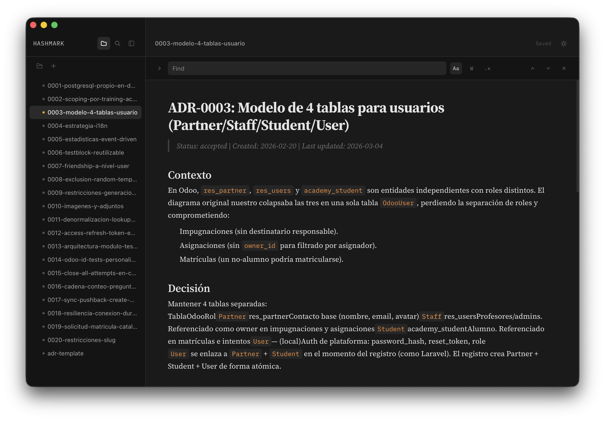

   
  
   

<h1 align="center">Hashmark</h1>

  A minimal, beautiful Markdown editor for macOS.
   
  Built with Tauri 2 + React 19 + Tiptap 3

  
  
  

  

---

`Cmd+S` Save · `Cmd+Shift+S` Save all · `Cmd+N` New file · `Cmd+O` Open folder · `Cmd+B` Toggle sidebar · `Cmd+F` Find · `Cmd+Shift+F` Find in files · `/` Slash commands

---

Rich Markdown editing · Slash commands · Bubble menu · Syntax highlighting · Find & replace across files · Modified file indicators · Dark & light themes with animated transition · Native macOS app
